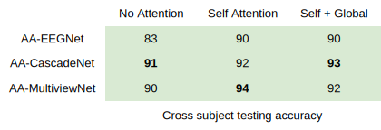

📡 Deep brain state classification of MEG data
========

This project aims to perform cross-subject multi-class classification based on MEG signals to infer the subject's state. The implemented models are AA-CascadeNet, AA-MultiviewNet and AA-EEGNet, all of which incorporates both self and global attention mechanisms. 


📑 States
-----

💤 Resting

💨 Motor Task

💾 Working Memory Task

❌ Story-Math Task 


✏️ Results
-----

The results for cross-subject testing of models that are trained with only 12 subjects on 6 testing subjects are shown below. 




💻 Commands
-----

The required modules can be installed  via

```
pip install -r requirements.txt
```

🚩 Citation
-----

If you decide to cite our project in your paper or use our data, please use the following bibtex reference:

.. code:: bibtex

  @misc{alaoui2020meg,
     title={Deep brain state classification of MEG data},
     author={Alaoui Abdellaoui, Ismail and García Fernández, Jesús and Şahinli, Caner and Mehrkanoon, Siamak},
     year={2020},
     url={}
  }
  
📂 Data
-----

- Data for the Cascade and the Multiview networks at the following `link <https://mega.nz/file/KcsXELzR#HLpcYcP7g5VM4NdAIM4M-hxXjyhtLncbrj4xUh6Zr9k>`__

- Data for EEGNet network at the following `link <https://mega.nz/file/GVk0EKCI#GX6agShuNWVx2ucktIiJPRkwLQDQCI6BNeFP-tq5pwM>`__

Both datasets contain the same subjects for training, validation, and testing, but they slightly differ in the trials selected.

📜 Scripts
-----
